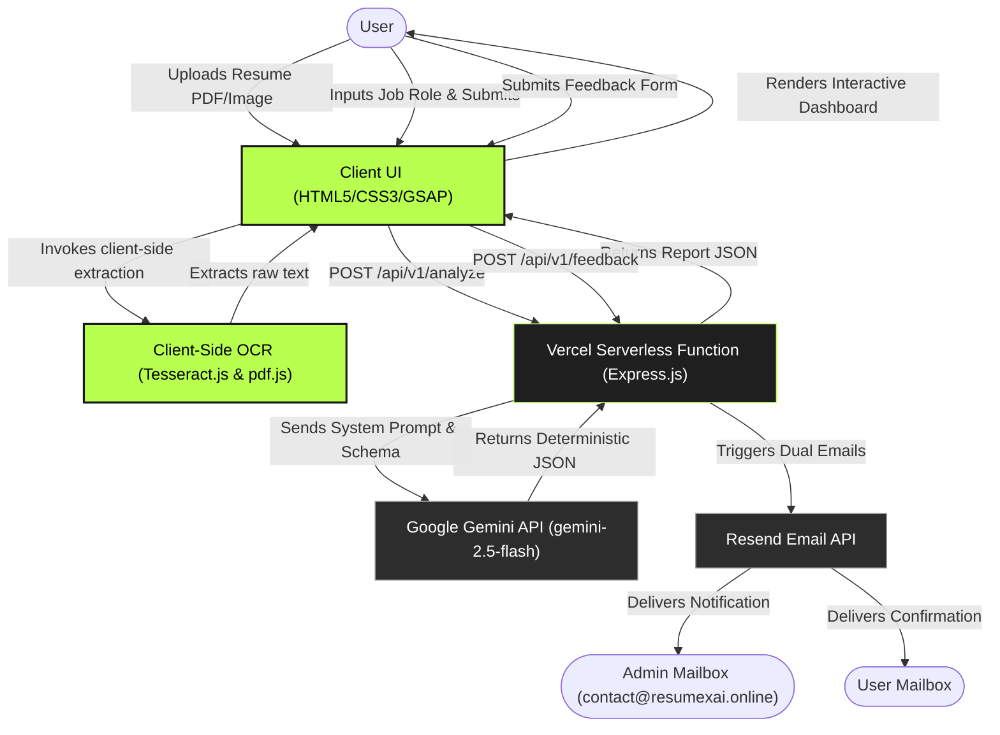

#  Resume X AI — Decoded.

[](https://resumexai.online)
[](https://nodejs.org)
[](https://expressjs.com)
[](https://deepmind.google/technologies/gemini)
[](https://resend.com)

> **Resume X AI** is an advanced, privacy-first career intelligence platform designed to analyze candidate resumes against targeted job roles, instantly expose critical skill gaps, and generate automated, custom learning roadmaps. 

---

##  System Architecture

The following flowchart outlines the end-to-end data flow, illustrating the client-side parsing pipeline, serverless routing, AI generation, and email notification system:



---

##  Technical Highlights

* **Hybrid Client-Side OCR Engine:** Employs `pdf.js` for programmatic text extraction from PDF streams and `Tesseract.js` for on-the-fly Optical Character Recognition (OCR) on image-based resumes (`.png`, `.jpg`, `.webp`), shifting parsing overhead to the client.
* **Privacy-First (Zero-Persistence) Policy:** Intentionally designed to process resumes in memory without database persistence. Candidate documents are parsed, evaluated, and discarded, complying with data privacy best practices.
* **Deterministic Structured JSON AI:** Integrates Google's latest `@google/genai` SDK with strict JSON schemas (`responseSchema`) configured at `temperature: 0` to guarantee structured, type-safe API payloads.
* **API Rate Limiting & Origin Controls:** Protected by `express-rate-limit` configured to allow up to 10 requests per 15-minute window per IP, coupled with strict CORS origin-filtering to shield the API.
* **Modern Kinetic UI/UX:** Built with a custom cursor ring tracker, particle canvas system, and GSAP timelines (`ScrollTrigger`) to offer a premium hackathon-level presentation.

---

##  Portal Layout & Pages

As a high-fidelity Single-Page Application (SPA), the system organizes operations into discrete interactive zones:

### 1. Splash Preloader & Landing
* **Launch Screen:** GSAP-driven loading sequence displaying application telemetry before animating the primary landing experience.
* **Hero Banner:** Ambient 2D connecting-node particle canvas responding to resize events.

### 2. Analysis Workshop
* **Upload Zone:** Drag-and-drop workspace supporting multiple document formats.
* **Interactive Editor:** Extracted text is instantly displayed in an editable textarea, letting users refine OCR mistakes before analysis.
* **Target Interface:** An input field to define the candidate's target role.

### 3. Report Dashboard
* **Dynamic ATS Score:** Instantly calculates the matching percentage using GSAP numeric counters.
* **Core Skill Analysis:** Highlights matched skills vs. missing skills using custom-colored tags.
* **AI Roadmap:** Generates an expandable, week-by-week progress guide tailored to close the candidate's specific skill gaps.

### 4. Interactive Feedback & Bug Portal
* **Telemetry Collection:** Form collecting candidate system metadata (device, browser) to debug edge cases.
* **Severity Matrix:** Features a 1-to-5 radio-button scale to log the critical nature of reported bugs.
* **Dual Dispatcher:** Dispatches formatted emails detailing issues and feature requests.

---

##  API Integrations

### 1. Google Gemini API (`gemini-2.5-flash`)
The core reasoning engine of Resume X AI. It performs deep semantic checks comparing the target job description with the extracted resume text.
* **Configuration:**
  ```javascript
  const response = await ai.models.generateContent({
      model: 'gemini-2.5-flash',
      contents: prompt,
      config: {
          temperature: 0,
          responseMimeType: "application/json",
          responseSchema: { ... }
      }
  });
  ```

### 2. Resend API
Used for immediate transactional notifications without local SMTP configuration.
* **Configuration:** Leverages the official `resend` Node SDK to dispatch beautifully formatted HTML emails from `contact@resumexai.online` to both the submitting user and the project administrator.

---

##  Data Models & API Schemas

Since this platform is serverless and does not persist user records, data schemas define the JSON payloads transferred across endpoints.

### 1. Resume Analysis API (`POST /api/v1/analyze`)
#### Request Payload
| Field | Type | Required | Description |
| :--- | :--- | :--- | :--- |
| `resume` | String | Yes | Plain text extracted from the candidate's resume |
| `role` | String | Yes | The target job title or role description |

#### Enforced AI JSON Response Schema
| Field | Type | Description |
| :--- | :--- | :--- |
| `matched` | Array (Strings) | Skills present in both the resume and the target role |
| `missing` | Array (Strings) | Critical skills required for the role but missing from the resume |
| `roadmap` | Array (Objects) | Weekly learning plan containing `week` (Int) and `content` (String) |
| `total` | Integer | Total number of core skills required for the target role |

### 2. Feedback Portal API (`POST /api/v1/feedback`)
#### Request Payload
| Field | Type | Required | Description |
| :--- | :--- | :--- | :--- |
| `name` | String | Yes | Full name of the user reporting the issue |
| `email` | String | Yes | Contact email address for follow-ups |
| `device` | String | Yes | System device category (Mobile, Laptop, Desktop PC, etc.) |
| `browser` | String | Yes | Web browser used (Chrome, Firefox, Safari, etc.) |
| `issues` | Array (Strings)| Yes | Checklist of issues encountered during usage |
| `description` | String | Yes | Details of the bug or user experience issue |
| `severity` | String/Int | Yes | Severity index scale from 1 (minor) to 5 (unusable) |
| `refreshFix` | String | Yes | User confirmation if refreshing the page resolved the bug |
| `contact` | String | Yes | User authorization for follow-up communication |
| `suggestions` | String | No | Feature requests or suggestions for optimization |

---

##  Local Setup & Deployment

### Prerequisites
* **Node.js** (v18.0.0 or higher)
* **NPM** (v9.0.0 or higher)

### 1. Installation
Clone the repository and install all dependencies:
```bash
git clone https://github.com/arkadeb69/scaleup.git
cd scaleup
npm install
```

### 2. Environment Configuration
Create a `.env` file in the root directory:
```env
GEMINI_API_KEY="your-google-gemini-api-key"
RESEND_API_KEY="your-resend-api-key"
```

### 3. Running Locally
Launch the local Express development server:
```bash
npm start
```
The application will run on [http://localhost:3000](http://localhost:3000).

### 4. Vercel Deployment
To deploy to production using Vercel, run:
```bash
npx vercel --prod
```
Ensure the environment variables (`GEMINI_API_KEY` and `RESEND_API_KEY`) are set in your Vercel Project Dashboard under **Settings > Environment Variables**.
